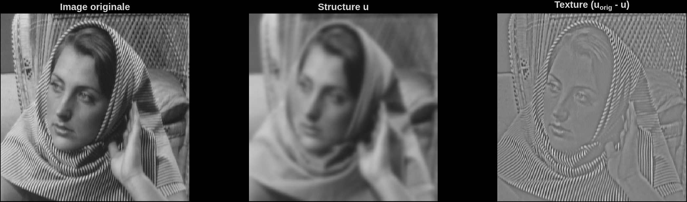
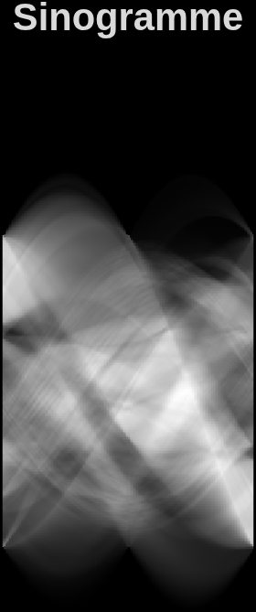
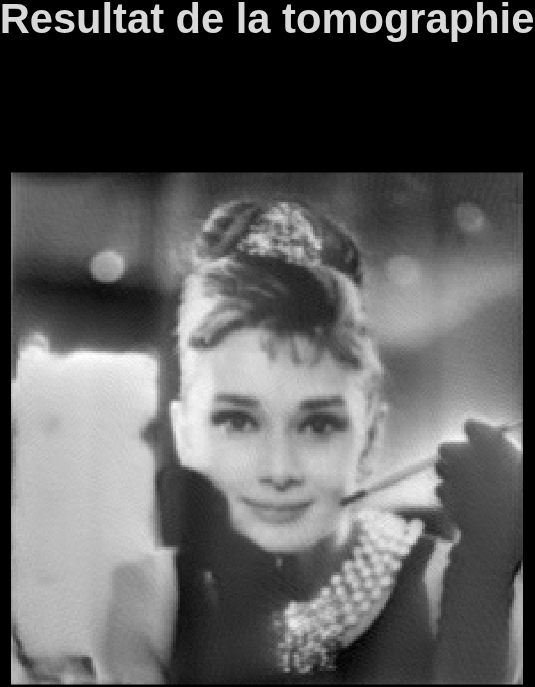
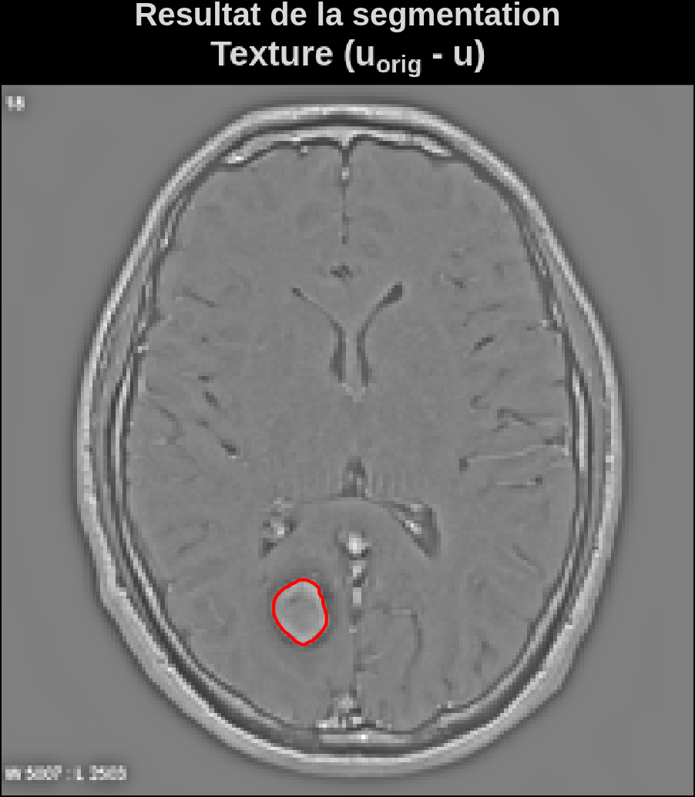
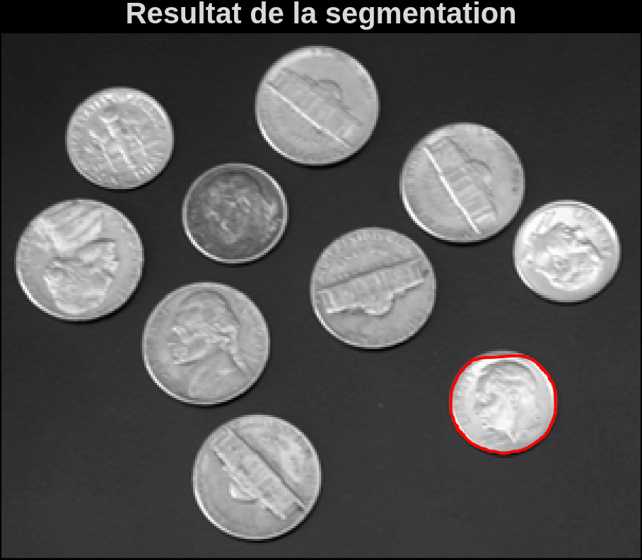
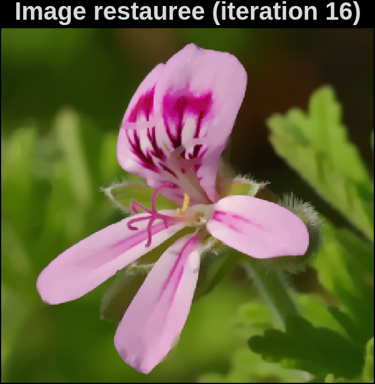
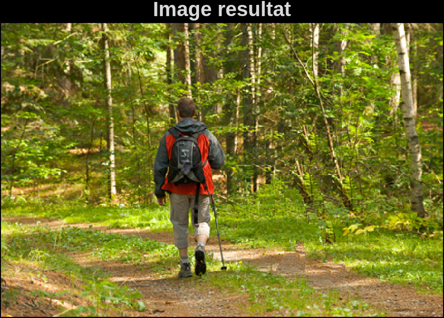
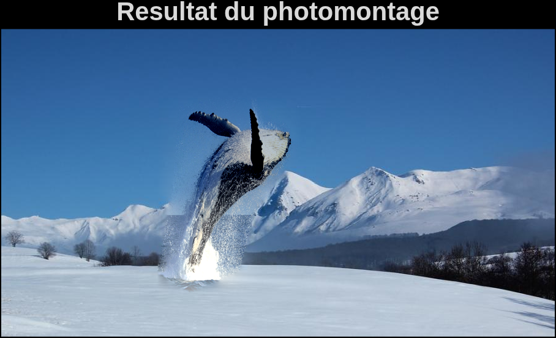
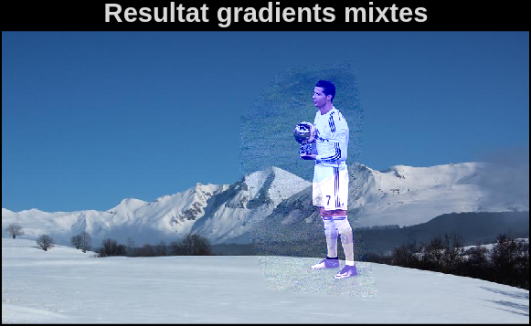

# Traitement des données audiovisuelles

Travaux pratiques du cours **Traitement des données audiovisuelles** – Toulouse INP N7, Mai 2026.
Auteur : **NASMANE Abdelhak**

Ce dépôt regroupe cinq TP MATLAB traitant de problèmes classiques en traitement d'image :
décomposition structure/texture, tomographie, contours actifs, restauration d'images et
photomontage. Chaque dossier contient le code source, les images de résultats et le
rapport PDF correspondant.

## Sommaire

| # | Projet | Rapport | Code source |
|---|--------|---------|-------------|
| 1 | [Décomposition d'image](#1--décomposition-dune-image) | [PDF](Decomposition_image/Decomposition_image.pdf) | [`src/`](Decomposition_image/src) |
| 2 | [Tomographie et transformation de Radon](#2--tomographie-et-transformation-de-radon) | [PDF](Tomographie/Tomographie.pdf) | [`src/`](Tomographie/src) |
| 3 | [Contours actifs (snakes)](#3--contours-actifs-snakes) | [PDF](contours_actifs/contours_actifs.pdf) | [`src/`](contours_actifs/src) |
| 4 | [Restauration variationnelle et inpainting](#4--restauration-variationnelle-et-inpainting) | [PDF](<restauration_images/Restauration variationnelle et inpainting d'images.pdf>) | [`src/`](restauration_images/src) |
| 5 | [Photomontage](#5--photomontage) | [PDF](photomontage/Photomontage.pdf) | [`src/`](photomontage/src) |

Un rapport de synthèse regroupant l'ensemble des TP est également disponible à la racine :
[`Rapport_Traitement_Donnees_Audiovisuelles.pdf`](Rapport_Traitement_Donnees_Audiovisuelles.pdf).

---

## 1 – Décomposition d'une image

Décomposition d'une image `u0` en une composante de **structure** `u` et une composante de
**texture** `uc` (`u0 = u + uc`), comparée sur quatre approches :

- partition franche du spectre de Fourier (filtre passe-bas rectangulaire) ;
- pondération fréquentielle douce (filtre gaussien) ;
- modèle variationnel **ROF** (Rudin–Osher–Fatemi, variation totale) ;
- modèle mixte **TV-Hilbert**.

Les expériences sont menées sur une grille périodique synthétique puis sur l'image *Barbara*.



📄 [Rapport complet](Decomposition_image/Decomposition_image.pdf) · 💻 [Scripts MATLAB](Decomposition_image/src)

---

## 2 – Tomographie et transformation de Radon

Reconstruction d'une image en niveaux de gris à partir de son sinogramme, obtenu par
**transformation de Radon** (nu = 501 rayons, nθ = 180 angles entre 0° et 179°). Trois
méthodes de reconstruction sont comparées :

- résolution algébrique itérative par l'algorithme de **Kaczmarz** ;
- **rétroprojection simple** ;
- **rétroprojection filtrée** par le filtre de Ram-Lak.

 

📄 [Rapport complet](Tomographie/Tomographie.pdf) · 💻 [Scripts MATLAB](Tomographie/src)

---

## 3 – Contours actifs (snakes)

Segmentation par contour actif (*snake*) : une courbe fermée évolue vers le contour d'un
objet sous l'effet d'un champ de force externe et de termes de régularisation (tension,
rigidité). Trois champs externes sont étudiés :

- champ **élémentaire** (gradient brut de l'image) ;
- champ **régularisé par filtrage gaussien** ;
- champ diffusé par **Gradient Vector Flow (GVF)**, qui étend la zone de capture du snake.

Expériences sur l'image *coins* et sur une IRM contenant une tumeur.

 

📄 [Rapport complet](contours_actifs/contours_actifs.pdf) · 💻 [Scripts MATLAB](contours_actifs/src)

---

## 4 – Restauration variationnelle et inpainting

Restauration d'images dégradées (bruit ou zones manquantes) par des approches
variationnelles et par exemplaires :

- **débruitage de Tikhonov** (régularisation quadratique) ;
- **débruitage par variation totale (TV)**, résolu par un schéma de point fixe ;
- **inpainting variationnel par diffusion** (masque connu ou obtenu par seuillage couleur,
  suppression automatique de texte) ;
- **inpainting par rapiéçage** (copie de patchs de texture) pour supprimer un objet de
  grande taille.

 

📄 [Rapport complet](<restauration_images/Restauration variationnelle et inpainting d'images.pdf>) · 💻 [Scripts MATLAB](restauration_images/src)

---

## 5 – Photomontage

Transfert d'une région d'une image source vers une image cible, comparé selon plusieurs
méthodes :

- **collage naïf** (remplacement direct des pixels) ;
- **photomontage par équation de Poisson** (le champ de gradients de la source est imposé
  et l'image est reconstruite par résolution d'un système de Poisson) ;
- **décoloration partielle** dans l'espace colorimétrique **LAB** ;
- **collage par gradients mixtes** (Pérez, Gangnet et Blake), qui préserve les structures à
  fort contraste déjà présentes dans la cible.

 

📄 [Rapport complet](photomontage/Photomontage.pdf) · 💻 [Scripts MATLAB](photomontage/src)

---

## Structure du dépôt

```
traitement-donnees-audiovisuelles/
├── Decomposition_image/
│   ├── Decomposition_image.pdf
│   ├── results/            # images générées (spectres, filtrages...)
│   └── src/                # scripts MATLAB (exercice_0.m à exercice_3.m...)
├── Tomographie/
│   ├── Tomographie.pdf
│   ├── results/
│   └── src/
├── contours_actifs/
│   ├── contours_actifs.pdf
│   ├── results/
│   └── src/
├── restauration_images/
│   ├── Restauration variationnelle et inpainting d'images.pdf
│   ├── results/
│   └── src/
├── photomontage/
│   ├── Photomontage.pdf
│   ├── results/
│   └── src/
└── Rapport_Traitement_Donnees_Audiovisuelles.pdf   # rapport de synthèse
```

## Prérequis

- MATLAB (Image Processing Toolbox recommandée).
- Ouvrir le dossier `src/` du projet souhaité et exécuter les scripts `exercice_*.m` dans
  l'ordre indiqué par le rapport correspondant.

## Auteur

**NASMANE Abdelhak** — Toulouse INP N7, Mai 2026.
